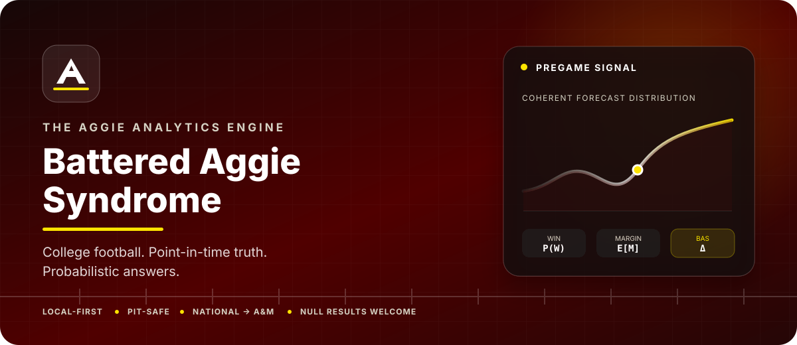
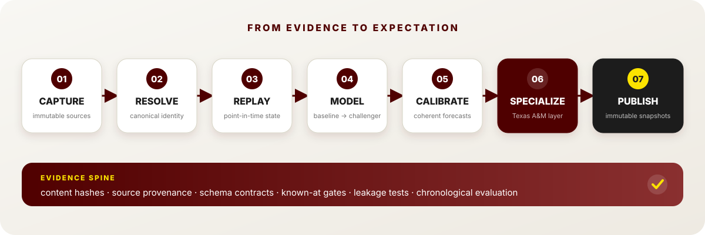
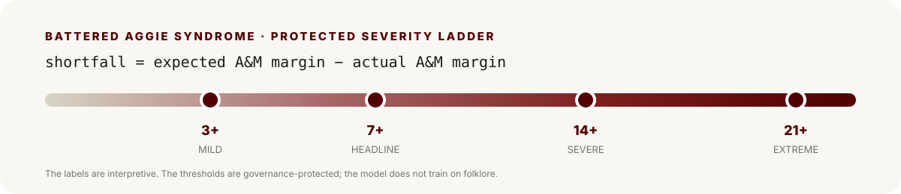

<p align="center">
  <picture>
    <source media="(max-width: 700px)" srcset="docs/assets/readme/hero-mobile.svg">
    
  </picture>
</p>

<h1 align="center">Battered Aggie Syndrome</h1>

<p align="center">
  <strong>The Aggie Analytics Engine</strong><br>
  A local-first research system for national college-football forecasting, high-resolution Texas A&amp;M analysis, and one gloriously testable question:
  <br><br>
  <em>Is Battered Aggie Syndrome statistically distinguishable from ordinary college-football variance?</em>
</p>

<p align="center">
  <a href="pyproject.toml"></a>
  <a href="src/aggie_analytics"></a>
  <a href="src/aggie_analytics/modeling"></a>
  <a href="requirements/product.lock"></a>
  <a href="docs/operations/LOCAL_RUNTIME_PATHS.md"></a>
  <a href="scripts"></a>
  <a href=".github/workflows"></a>
</p>

---

> A local-first college-football forecasting and research engine built to answer the question every Aggie has asked by the fourth quarter:
>
> **“Was that actually improbable, or have I simply attended Texas A&M long enough?”**

Battered Aggie Syndrome is a serious probabilistic sports-analytics project wrapped around a deeply unserious coping mechanism. It builds national college-football models, adds a higher-resolution Texas A&M specialization layer, and scientifically tests whether the Aggies underperform neutral pregame expectations more often—or more spectacularly—than comparable programs.

The system does not begin with the assumption that Texas A&M is cursed. It begins with immutable data, chronological evaluation, and a null hypothesis. The curse must earn promotion through the same protected validation gates as everything else.

## At a glance

<table>
  <tr>
    <td width="33%" valign="top">
      <h3>National foundation</h3>
      Learns college-football behavior across teams, seasons, schedules, and regimes to create a neutral pregame expectation.
    </td>
    <td width="33%" valign="top">
      <h3>A&amp;M specialization</h3>
      Adds deeper Texas A&amp;M evidence only when it improves on the unchanged national forecast under chronological evaluation.
    </td>
    <td width="33%" valign="top">
      <h3>BAS science</h3>
      Measures expectation-relative shortfall, tail severity, peer context, and stability without letting folklore become a feature.
    </td>
  </tr>
</table>

The national foundation provides the neutral expectation required to distinguish “an unusual Aggie outcome” from “college football happened again.” The result is not merely a predictor. It is an evidence system designed to answer *what was knowable before kickoff, what did the model expect, what actually happened, and how unusual was the gap?*

## Why this project is different

College-football prediction is difficult for all the usual reasons: sparse seasons, constant roster turnover, coaching changes, injuries, uneven schedules, changing conferences, limited historical availability, and a suspicious number of games played by 19-year-olds in front of 100,000 emotionally stable adults.

| Principle | What it means here |
|---|---|
| **Time is a first-class feature** | Every observation has source, event, capture, and known-at semantics. A current page cannot silently backfill historical knowledge. |
| **The target game is off-limits** | A game cannot train, tune, calibrate, or leak into its own pregame forecast. |
| **Forecasts must agree with themselves** | Win probability, score, margin, total, and uncertainty are derived from coherent distributions—not unrelated guesses. |
| **Complexity must earn promotion** | Historical averages, home-field rules, Elo, regularized models, and score distributions establish the floor before boosting or neural challengers. |
| **Evidence is reproducible** | Raw captures, matrices, models, and forecast snapshots are immutable, content-addressed, and connected by provenance. |
| **The null result is a valid result** | Texas A&amp;M specialization may resolve to no adjustment; BAS may resolve to no stable excess effect. Both outcomes are scientifically acceptable. |

## Architecture

<p align="center">
  <picture>
    <source media="(max-width: 700px)" srcset="docs/assets/readme/system-map-mobile.svg">
    
  </picture>
</p>

The engine is organized around seven explicit transitions:

1. **Capture** public source evidence without mutating the original payload.
2. **Resolve** stable team, game, player, coach, venue, and source identities.
3. **Replay** only the state known before a forecast cutoff.
4. **Model** with interpretable baselines before bounded challengers.
5. **Calibrate** coherent win, score, margin, total, and uncertainty distributions.
6. **Specialize** for Texas A&amp;M against a mandatory no-adjustment reference.
7. **Publish** immutable, read-only forecast snapshots for product surfaces.

Bulk data and runtime artifacts remain outside Git under `AGGIE_ANALYTICS_DATA_ROOT`. The repository holds the code, contracts, schemas, prompts, validators, small evidence artifacts, and documentation required to reproduce those transitions.

## BAS, quantified

For a Texas A&amp;M game, the neutral national model produces a pregame expected margin. BAS is measured from the residual—not from wins, losses, vibes, or message-board temperature.

```text
performance residual = actual A&M margin − expected A&M margin
BAS shortfall        = expected A&M margin − actual A&M margin
```

<p align="center">
  <picture>
    <source media="(max-width: 700px)" srcset="docs/assets/readme/bas-spectrum-mobile.svg">
    
  </picture>
</p>

The 7-point shortfall is the headline BAS event. The 3-, 14-, and 21-point levels preserve mild, severe, and extreme tail behavior.

| Shortfall | Scientific interpretation | Completely unscientific Aggie translation |
|---:|---|---|
| 3+ | Mild underperformance | “That feels familiar.” |
| 7+ | Headline BAS event | “Here we go.” |
| 14+ | Severe BAS event | “Do not open the group chat.” |
| 21+ | Extreme BAS event | “Tradition has entered the model.” |

Those jokes are labels for humans, not model inputs. The system does not train on vibes, message-board despair, yell intensity, or how early someone muttered “I’ve seen this movie before.”

## The qualitative model — for humans only

<p align="center">
  
</p>

<p align="center">
  <strong>At kickoff: optimism. At halftime: variance. By the fourth quarter: the protected holdout.</strong><br>
  <sub>Cultural context only—never a feature, label, prior, or source of model truth.</sub>
</p>

## Scientific contract

The project treats forecasting claims as earned privileges:

- **No future leakage.** A forecast uses only evidence available at its cutoff.
- **No target leakage.** Outcomes and outcome-derived fields are isolated from pregame features.
- **No fabricated completeness.** Missing, contradictory, or timestamp-unknown evidence remains missing, conditional, or quarantined.
- **No name-only identity merges.** Entity resolution must retain source evidence and pass deterministic identity controls.
- **Chronology over random splits.** Development, tuning, replay, and protected evaluation preserve real forecasting order.
- **Protected rules stay protected.** Models cannot move the split, metric, threshold, or promotion gate to improve their own score.
- **Candidate means candidate.** Assistive AI, research automation, and experimental features cannot directly alter canonical truth or champion state.
- **No narrative rescue.** A preferred model, feature, or Aggie story can be rejected by the evidence.

Read the full [validation and protected-split contract](docs/56_VALIDATION_AND_PROTECTED_SPLITS.md) and [source-of-truth map](governance/SOURCE_OF_TRUTH_MAP.md).

## Project status

> [!IMPORTANT]
> The architecture and starter system are extensive; the scientific conclusions are intentionally unfinished. Historical materialization and chronological replay are active. Existing real-data baseline artifacts are **preliminary and unprotected** unless an artifact explicitly proves a stronger eligibility class.

### Built and exercised

- immutable source snapshots, content hashes, and provenance manifests;
- canonical identity and point-in-time gateway interfaces;
- real historical acquisition, reconciliation, and domain-specific eligibility gates;
- feature lifecycle, missingness, leakage, and replay controls;
- historical-average, home-field, Elo, regularized, score-distribution, and bounded boosting baseline paths;
- calibration, ensemble, uncertainty, A&amp;M specialization, and BAS interfaces;
- governed experiment identity, replay, queue, and promotion machinery;
- snapshot-only API and static dashboard boundaries;
- local operations, Jira evidence synchronization, repository integrity, CodeQL, and dependency controls.

### Explicitly not claimed

- final national historical-population completeness;
- a trained production champion;
- protected real-world performance;
- a production feature set;
- proven Texas A&amp;M specialization lift;
- a statistically supported BAS or Aggie Excess effect;
- profitable wagering performance;
- production-ready neural, graph, or live-game modeling.

That honesty boundary is part of the product. This repository would rather publish a null result than hang a national-championship banner for a backtest.

See the [component maturity matrix](docs/final/FINAL_COMPONENT_MATURITY.csv), [known gaps](docs/final/FINAL_KNOWN_GAPS.md), and [implementation priority](docs/final/FINAL_IMPLEMENTATION_PRIORITY.md).

## Model ladder

| Stage | Model family | Purpose |
|---:|---|---|
| 01 | Historical and home-field baselines | Establish the minimum sanity floor and cold-start behavior |
| 02 | Elo / rating systems | Maintain interpretable, continuously updated team strength |
| 03 | Regularized linear and logistic models | Produce explainable margin and win-probability baselines |
| 04 | Poisson / Skellam score models | Produce coherent team-score and margin distributions |
| 05 | Gradient-boosted trees | Capture nonlinearities after the simple pipeline is validated |
| 06 | Calibrated ensembles | Combine independently useful forecasts without mixing incompatible lanes |
| 07 | Advanced challengers | Enter only after data sufficiency and baseline-saturation gates pass |

No model family is declared the winner in advance. The protected scorecard decides.

A model advances because the evidence says so—not because its output looks especially good next to a maroon PowerPoint template.

## Technology

| Layer | Current project choices |
|---|---|
| **Language** | Python 3.11–3.13; Python 3.12 is the preferred CI/runtime target |
| **Analytics** | Polars and NumPy for materialization and numerical paths; Parquet for partitioned analytical data |
| **Modeling** | scikit-learn-compatible baselines, Elo, regularized GLMs, Poisson/Skellam, and bounded tree boosting |
| **Storage** | Immutable files, JSON/CSV manifests, content-addressed captures, external raw/canonical/PIT/training/model roots |
| **Serving** | Optional FastAPI/Uvicorn adapter over already-published immutable snapshots |
| **Operations** | PowerShell-first local Windows workflows with cross-platform GitHub Actions |
| **Assurance** | Unit and integration tests, schema validation, PIT/leakage gates, deterministic replay, CodeQL, and dependency auditing |
| **Research assistance** | Governed optional OpenAI candidate plane; never a forecast-critical runtime dependency or source of canonical truth |

Optional libraries remain replaceable adapters. MLflow cannot declare a champion, Optuna cannot inspect protected outcomes, and the dashboard cannot secretly retrain the model because somebody refreshed the page aggressively.

## Quick start

### Prerequisites

- Git
- Python 3.12 recommended
- PowerShell on Windows

### 1 · Clone

```powershell
git clone https://github.com/KevinSGarrett/BatteredAggieSyndrome.git
Set-Location BatteredAggieSyndrome
```

### 2 · Bootstrap

```powershell
powershell -ExecutionPolicy Bypass -File scripts/bootstrap.ps1
.\.venv\Scripts\Activate.ps1
```

### 3 · Point runtime data outside Git

```powershell
$env:AGGIE_ANALYTICS_DATA_ROOT = "C:\BatteredAggieSyndrome.data"
```

### 4 · Validate

```powershell
python -B -m unittest discover -s tests -p "test_*.py" -v
python -B tools/validate_w25_final.py --repo-root .
python -B tools/validate_repository.py --repo-root . --strict
```

<details>
<summary><strong>Optional snapshot-serving adapter</strong></summary>

```powershell
python -m pip install --require-hashes -r requirements/product.lock
python -m pip install --no-deps -e .
python tools/run_product.py --snapshot-root <published-forecast-root>
```

Product requests read previously published forecast snapshots. They do not invoke acquisition, feature generation, training, or hidden request-time inference.

</details>

For operational boundaries, see [local runtime paths](docs/operations/LOCAL_RUNTIME_PATHS.md) and [credentials and secrets](docs/operations/CREDENTIALS_AND_SECRETS.md).

## Repository map

```text
BatteredAggieSyndrome/
├── src/aggie_analytics/   engine packages: data → PIT → modeling → product
├── tests/                 unit, contract, governance, replay, and integration tests
├── configs/               versioned machine-readable registries and policies
├── governance/            scientific controls, decision rules, and protected gates
├── schemas/               data, evidence, experiment, model, and forecast contracts
├── tools/                 builders, validators, replay runners, and operators
├── scripts/               bootstrap and target-machine entry points
├── artifacts/             small tracked evidence—not the bulk data lake
├── docs/                  architecture, implementation, research, and runbooks
└── jira/                  canonical work records, evidence, and synchronization pack
```

## Documentation flight plan

| If you want to… | Start here |
|---|---|
| Understand the system | [Architecture](docs/01_ARCHITECTURE.md) |
| See what is real vs. still pending | [Component maturity](docs/final/FINAL_COMPONENT_MATURITY.csv) |
| Review scientific evaluation | [Validation and protected splits](docs/56_VALIDATION_AND_PROTECTED_SPLITS.md) |
| Inspect unresolved limitations | [Known gaps](docs/final/FINAL_KNOWN_GAPS.md) |
| Follow implementation order | [Final implementation priority](docs/final/FINAL_IMPLEMENTATION_PRIORITY.md) |
| Configure local storage | [Local runtime paths](docs/operations/LOCAL_RUNTIME_PATHS.md) |
| Handle credentials safely | [Credentials and secrets](docs/operations/CREDENTIALS_AND_SECRETS.md) |
| Contribute a change | [Contributing guide](CONTRIBUTING.md) |

## Frequently asked questions

<details>
<summary><strong>Does the model assume Texas A&amp;M will disappoint me?</strong></summary>

Every Saturday will disappoint you as an Aggie.

</details>

<details>
<summary><strong>Is BAS just another name for losing?</strong></summary>

No. BAS is expectation-relative. A close loss to a much stronger opponent can outperform expectation; an ugly win can underperform it.

</details>

<details>
<summary><strong>Why use national data for an A&amp;M project?</strong></summary>

Without a national reference, the system cannot distinguish unusual A&amp;M behavior from ordinary college-football volatility. The national model supplies the counterfactual; the specialization layer tests whether deeper local evidence adds value.

</details>

<details>
<summary><strong>Is this a sports-betting system?</strong></summary>

Yes. Always put double your net worth on A&M to disappoint you. 100% guaranteed odds of winning.

</details>

<details>
<summary><strong>What happens if the data says BAS is not real?</strong></summary>

Then the project reports the null result, closes the laptop, and continues experiencing BAS recreationally.

</details>

## Contributing

Contributions should preserve the core invariants: stable identity, immutable evidence, explicit known-at time, target-game exclusion, chronological evaluation, and honest maturity claims. Start with [CONTRIBUTING.md](CONTRIBUTING.md), then run the strict repository validator before opening a pull request.

---

<p align="center">
  <strong>Built with Python, probability, and off-season BAS confidence that this is for sure A&amp;M's year to win the National Championship.</strong><br>
  <sub>Independent personal research project. Not affiliated with or endorsed by Texas A&amp;M University, the NCAA, or any data provider.</sub><br><br>
  <span>Gig ’em.</span>
</p>
