# Battered Aggie Syndrome

### The Aggie Analytics Engine

[](https://github.com/KevinSGarrett/BatteredAggieSyndrome/actions/workflows/ci.yml)
[](https://github.com/KevinSGarrett/BatteredAggieSyndrome/actions/workflows/security.yml)

> A local-first college-football forecasting and research engine built to answer the question every Aggie has asked by the fourth quarter:
>
> **“Was that actually improbable, or have I simply attended Texas A&M long enough?”**

Battered Aggie Syndrome is a serious probabilistic sports-analytics project wrapped around a deeply unserious coping mechanism. It builds national college-football models, adds a higher-resolution Texas A&M specialization layer, and scientifically tests whether the Aggies underperform neutral pregame expectations more often—or more spectacularly—than comparable programs.

The system does not begin with the assumption that Texas A&M is cursed. It begins with immutable data, chronological evaluation, and a null hypothesis. The curse must earn promotion through the same protected validation gates as everything else.

## The one-sentence version

This project turns historical college-football data into point-in-time-correct team and player state, produces coherent probabilistic forecasts, and measures **BAS** as the difference between what a neutral pregame model expected from Texas A&M and what actually happened.

## Why this exists

College-football prediction is difficult for all the usual reasons: sparse seasons, constant roster turnover, coaching changes, injuries, uneven schedules, changing conferences, limited historical availability, and a suspicious number of games played by 19-year-olds in front of 100,000 emotionally stable adults.

Texas A&M adds a particularly interesting research question:

- Is the program genuinely more volatile than its peers?
- Does it underperform expectations at an unusual rate?
- Are the painful outcomes explainable by opponent strength, roster state, coaching regimes, game context, or ordinary variance?
- Is “Battered Aggie Syndrome” measurable—or just a highly developed cultural reflex?

Rather than hard-code the folklore, this project tests it.

## BAS, quantified

For a Texas A&M game, the primary residual is:

```text
performance residual = actual A&M margin - expected A&M margin
```

The corresponding shortfall is:

```text
BAS shortfall = expected A&M margin - actual A&M margin
```

The expectation must be generated before the game by a BAS-independent national model, using only information that was actually available at the forecast cutoff. The target game cannot train, tune, or otherwise leak into its own expectation.

The protected BAS severity thresholds are 3, 7, 14, and 21 points. The 7-point shortfall is the headline event.

| Shortfall | Scientific interpretation | Completely unscientific Aggie translation |
|---:|---|---|
| 3+ | Mild underperformance | “That feels familiar.” |
| 7+ | Headline BAS event | “Here we go.” |
| 14+ | Severe BAS event | “Do not open the group chat.” |
| 21+ | Extreme BAS event | “Tradition has entered the model.” |

Those jokes are labels for humans, not model inputs. The system does not train on vibes, message-board despair, yell intensity, or how early someone muttered “I’ve seen this movie before.”

## What the system does

The intended end-to-end system:

1. Acquires national historical college-football data and preserves the exact source payloads.
2. Normalizes teams, games, players, coaches, venues, conferences, and source identities.
3. Builds point-in-time (PIT) state containing only information known before each prediction.
4. Creates versioned features for team strength, efficiency, roster state, continuity, context, weather, market information, and other evidence-supported domains.
5. Trains simple, interpretable baselines before evaluating more complex challengers.
6. Produces coherent score, margin, win, total, uncertainty, and BAS-related distributions.
7. Evaluates models chronologically through walk-forward and protected holdout protocols.
8. Adds a Texas A&M specialization layer only if it improves upon the unchanged national forecast.
9. Publishes immutable forecast snapshots for read-only API and dashboard consumption.

## How it works

```mermaid
flowchart LR
    A["Source APIs, archives, and public data"] --> B["Immutable raw snapshots"]
    B --> C["Canonical identities and observations"]
    C --> D["Point-in-time state"]
    D --> E["Versioned features and training matrices"]
    E --> F["National baseline and challenger models"]
    F --> G["Calibration, uncertainty, and ensembles"]
    G --> H["Texas A&M specialization"]
    H --> I["BAS and Aggie Excess tests"]
    G --> J["Immutable forecast snapshots"]
    I --> J
    J --> K["Read-only API and dashboard"]
```



### 1. National foundation

The national model learns broad college-football behavior across teams and seasons. This provides the neutral expectation required to distinguish “an unusual Aggie outcome” from “college football happened again.”

### 2. Texas A&M specialization

A higher-resolution A&M layer can use deeper roster, staff, availability, venue, matchup, and program-regime evidence. It must always be compared with the unchanged national forecast. If specialization does not provide reproducible lift, the correct adjustment is no adjustment.

### 3. Coherent forecasting

Win probability, team scores, margin, total, and BAS probabilities cannot be contradictory independent guesses. The model layer is designed around coherent score and margin distributions from which related forecast quantities are derived.

### 4. Protected evaluation

Models are developed and judged chronologically. Protected periods cannot be used to tune features, select hyperparameters, move thresholds, or rescue a preferred story. A model advances because the evidence says so—not because its output looks especially good next to a maroon PowerPoint template.

## Model strategy

The project is deliberately baseline-first:

| Model family | Role |
|---|---|
| Historical and home-rate baselines | Establish the minimum sanity floor |
| Elo | Maintain interpretable, continuously updated team-strength ratings |
| Logistic regression / GLMs | Produce explainable win and margin baselines |
| Poisson / Skellam score models | Produce coherent score and margin distributions |
| Gradient-boosted trees | Capture nonlinear effects and feature interactions |
| Calibrated ensembles | Combine independently useful models without mixing incompatible forecast lanes |
| Small neural models | Optional challengers that must beat strong tabular baselines to justify their complexity |

No model family is declared the winner in advance. XGBoost, LightGBM, CatBoost, scikit-learn boosting, PyTorch, Bayesian, hierarchical, and distributional approaches are candidates—not articles of faith.

## Feature selection and “what matters”

The engine is designed to find useful predictors through chronological evidence rather than intuition alone. Candidate features can be examined through:

- missingness and computability analysis;
- variance and correlation screening;
- mutual information;
- permutation importance;
- feature-family ablation;
- interaction and redundancy analysis;
- stability across seasons, regimes, teams, and A&M/peer slices;
- calibration and out-of-distribution behavior;
- protected walk-forward performance.

A feature is not promoted merely because it has an impressive chart or a football-sounding name. It must be point-in-time safe, reproducible, sufficiently available, and useful beyond the period in which it was discovered.

## Data integrity rules

The core invariants are intentionally strict:

- **No future leakage.** A forecast may use only evidence known at its cutoff.
- **No target-game leakage.** A game’s outcome cannot participate in its own features or expectation.
- **Immutable evidence.** Raw captures, derived matrices, model artifacts, and forecasts are content-addressed or versioned.
- **Stable identity.** Teams, games, players, coaches, venues, and source records retain canonical IDs and provenance.
- **No fabricated values.** Missing historical evidence remains missing, conditional, or quarantined.
- **Chronological validation.** Random train/test splits do not substitute for real forecasting chronology.
- **Null results are valid.** The project must be able to conclude that Aggie Excess is not statistically supported.

## Data and storage architecture

Large data lives outside Git under `AGGIE_ANALYTICS_DATA_ROOT`:

```text
RAW
  -> QUARANTINE
  -> CANONICAL
  -> PIT_STATE
  -> FEATURES
  -> TRAINING
  -> MODEL_ARTIFACTS
  -> FORECAST_SNAPSHOTS
```

The repository contains code, schemas, contracts, validators, manifests, small fixtures, and documentation. Bulk source payloads, training matrices, experiment stores, and model binaries remain outside the repository.

The preferred local analytical design uses native immutable raw files, partitioned Parquet, and local columnar processing. DuckDB and Polars are preferred candidates where their SQL, lazy, or streaming execution creates measurable value. PostgreSQL and distributed infrastructure remain optional until a real workload justifies them.

## Technical stack

- **Language:** Python 3.11–3.13; Python 3.12 preferred
- **Execution:** Local-first Windows development, cross-platform CI
- **Storage:** Content-addressed files, JSON/CSV manifests, partitioned Parquet
- **Analytics:** Polars and DuckDB-oriented local analytical boundary
- **Baseline ML:** scikit-learn-compatible GLMs and boosting candidates
- **Advanced candidates:** XGBoost, LightGBM, CatBoost, statsmodels, PyTorch
- **Experiment tracking:** Aggie-owned immutable evidence with optional MLflow adapter
- **Hyperparameter optimization:** Bounded development-only searches with optional Optuna adapter
- **Serving:** Immutable snapshots through an optional FastAPI adapter and static dashboard
- **Quality:** Unit tests, strict repository validation, leakage gates, schema checks, replay tests, CodeQL, and dependency auditing

Optional libraries remain replaceable adapters. MLflow cannot declare a champion, Optuna cannot inspect protected outcomes, and the dashboard cannot secretly retrain the model because somebody refreshed the page aggressively.

## Current maturity

The 25-wave architecture and starter-build program is complete. Post-wave implementation is now materializing and validating real historical data before empirical model training.

Already present:

- immutable source-snapshot and provenance contracts;
- canonical identity and PIT interfaces;
- feature lifecycle and screening machinery;
- baseline, joint-score, calibration, ensemble, uncertainty, and BAS interfaces;
- experiment identity, replay, queue, tournament, and promotion governance;
- weekly orchestration and immutable publication starters;
- snapshot-only API and dashboard boundaries;
- extensive synthetic, governance, packaging, and security validation.

Not yet claimed:

- a trained production champion;
- protected real-world performance metrics;
- a production feature set;
- proven Texas A&M specialization lift;
- a statistically supported BAS or Aggie Excess effect;
- profitable wagering performance;
- production-ready advanced neural, graph, or live-game modeling.

That boundary is deliberate. This repository would rather admit that the model is not trained yet than hang a national championship banner for a backtest.

See [the final implementation priority](docs/final/FINAL_IMPLEMENTATION_PRIORITY.md), [known gaps](docs/final/FINAL_KNOWN_GAPS.md), and [component maturity table](docs/final/FINAL_COMPONENT_MATURITY.csv) for the detailed handoff state.

## Quick start

### Prerequisites

- Git
- Python 3.12 recommended
- PowerShell on Windows

### Clone

```powershell
git clone https://github.com/KevinSGarrett/BatteredAggieSyndrome.git
Set-Location BatteredAggieSyndrome
```

### Bootstrap on Windows

```powershell
powershell -ExecutionPolicy Bypass -File scripts/bootstrap.ps1
.\.venv\Scripts\Activate.ps1
```

### Validate the repository

```powershell
python -B -m unittest discover -s tests -p "test_*.py" -v
python -B tools/validate_w25_final.py --repo-root .
python -B tools/validate_repository.py --repo-root . --strict
```

### Optional product adapter

```powershell
python -m pip install --require-hashes -r requirements/product.lock
python -m pip install --no-deps -e .
python tools/run_product.py --snapshot-root <published-forecast-root>
```

Product requests read previously published forecast snapshots. They do not invoke acquisition, feature generation, training, or hidden request-time inference.

## Configuration and secrets

Set the external runtime root explicitly:

```powershell
$env:AGGIE_ANALYTICS_DATA_ROOT = "C:\BatteredAggieSyndrome.data"
```

See [local runtime paths](docs/operations/LOCAL_RUNTIME_PATHS.md) and [credentials and secrets](docs/operations/CREDENTIALS_AND_SECRETS.md) for the operational contracts.

## Repository map

```text
src/aggie_analytics/   Core Python package
tests/                 Unit, contract, governance, and integration tests
configs/               Versioned machine-readable registries
governance/            Requirements, ADRs, gates, policies, and scientific controls
docs/                  Architecture, implementation, research, and operating documentation
schemas/               Data and artifact schemas
scripts/               Bootstrap and operational entry points
tools/                 Validators, generators, and repository utilities
artifacts/             Small tracked evidence and reports—not the bulk data lake
jira/                  Local Jira planning, evidence, and synchronization pack
```

## Frequently asked questions

### Does the model assume Texas A&M will disappoint me?

Every Saturday will disappoint you as an Aggie.

### Is BAS just another name for losing?

No. BAS is expectation-relative. A narrow loss to a much stronger opponent can outperform expectation; an ugly win can underperform it. The relevant quantity is the difference between expected and actual margin.

### Why use national data for an A&M project?

Without a national reference, the system cannot tell whether A&M is unusual or merely participating in college football. The national foundation supplies the counterfactual baseline; the A&M layer tests whether deeper local evidence adds value.

### Is this a sports-betting system?

Yes. Always put double your net worth on A&M to disappoint you. 100% guaranteed odds of winning.

### What happens if the data says BAS is not real?

Then the project reports the null result, closes the laptop, and continues experiencing BAS recreationally.

## Gig ’em

Built with Python, probability, and off-season BAS confidence that this is for sure A&M's year to win the National Championship.
