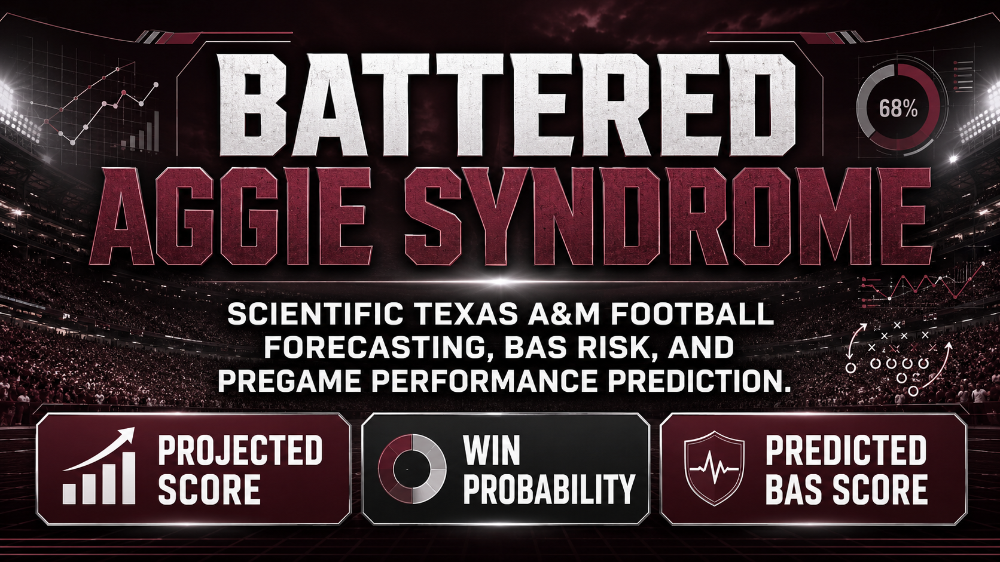
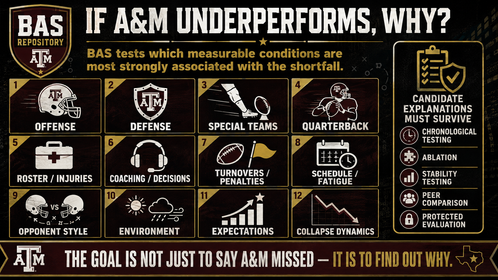
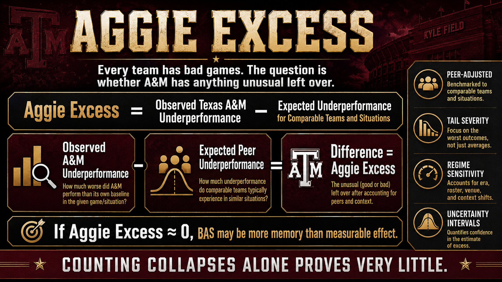
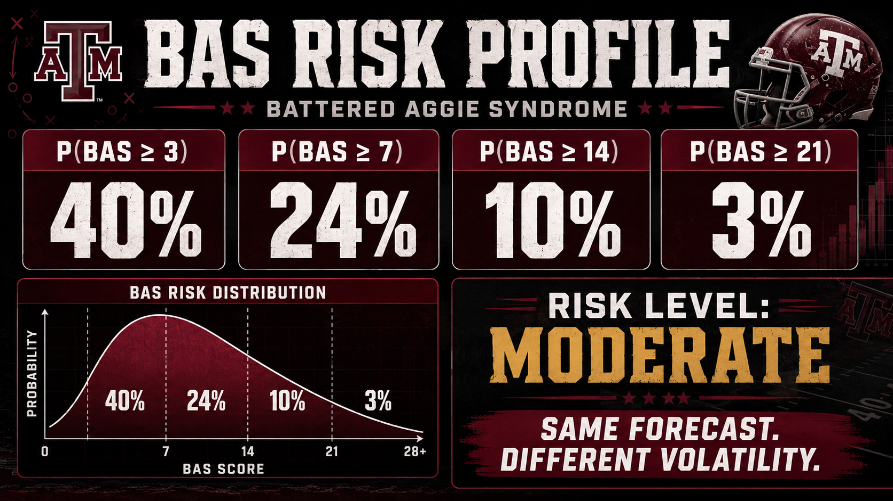
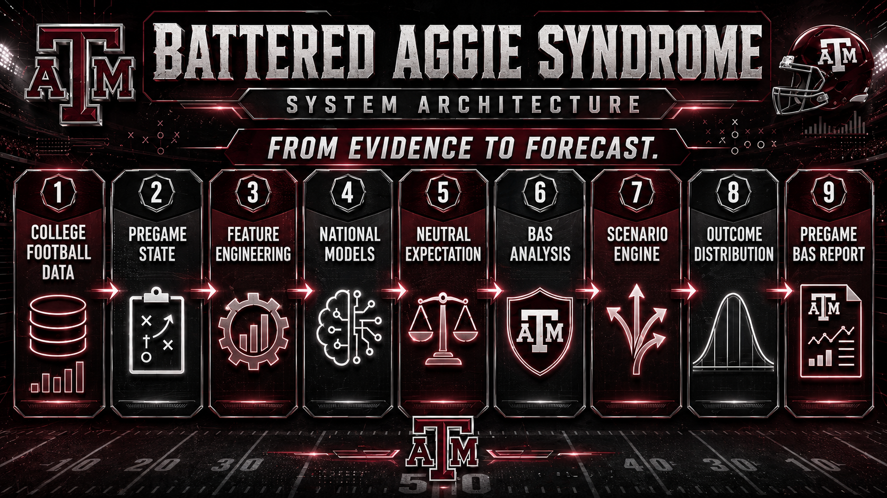

<p align="center">
  
</p>

<h1 align="center">Battered Aggie Syndrome</h1>

<p align="center"><strong>Scientific research funded by residual Dennis Franchione newsletter proceeds.</strong></p>

<p align="center">College football analytics · Explainable forecasting · Texas A&amp;M research</p>

<p align="center">
  <a href="pyproject.toml"></a>
  <a href="docs/public/TECHNOLOGY.md"></a>
  <a href="docs/public/TECHNOLOGY.md"></a>
  <a href="docs/public/TECHNOLOGY.md#modeling-and-evaluation"></a>
  <a href="docs/public/GETTING_STARTED.md#run-the-snapshot-api-and-dashboard"></a>
  <a href="REPRODUCIBILITY.md"></a>
  <a href="docs/public/GETTING_STARTED.md"></a>
  <a href="https://github.com/KevinSGarrett/BatteredAggieSyndrome/actions"></a>
</p>

<p align="center">
  <a href="#the-bas-research-framework">Research framework</a> ·
  <a href="#how-bas-differs-from-a-score-predictor">Why BAS?</a> ·
  <a href="#technical-usage">Technical usage</a> ·
  <a href="#technology-stack">Tech stack</a> ·
  <a href="docs/public/README.md">Documentation</a>
</p>

**Does Texas A&M football consistently underperform expectations enough to prove Battered Aggie Syndrome is real—or is it all just $\color{red}{\text{Sliced Bread}}$?**

The project brings together sports data engineering, point-in-time features, probabilistic forecasting, and reproducible statistical analysis—all in pursuit of one question generations of Aggies have asked: is Battered Aggie Syndrome statistically real, or has Texas A&M football simply trained us to expect the worst?

The **Aggie Analytics Engine** is the research software behind BAS. Start with national college football, establish what comparable teams should achieve, measure the gap between expectation and result, then investigate whether an A&M-specific pattern survives scrutiny. A convincing “no unusual effect” is as useful as a convincing “yes.”

## The BAS Research Framework

Talent does not play a schedule by itself. Coaches, quarterbacks, injuries, opponents, travel, weather, and game situations can all change what a reasonable expectation looks like.

| Research area | Data and questions |
|---|---|
| **National results and expectations** | Schedules, scores, opponents, home field, conference and subdivision context, strength of schedule, team-strength priors, and comparable programs. |
| **Offense, defense, and special teams** | Team and player box scores, drives, play-by-play, scoring opportunities, explosive plays, turnovers, and situational performance. |
| **Coaching and program changes** | Head coaches, coordinators, staff continuity, scheme changes, tenure, and performance across coaching regimes. |
| **Recruiting and roster talent** | Recruiting evaluations, position groups, roster turnover, transfers, player experience, and returning production. |
| **Quarterbacks and availability** | Depth charts, quarterback continuity, verified pregame injury/availability reports, and uncertainty around missing evidence. |
| **Weather and playing conditions** | Forecast vintages, temperature, wind, precipitation, venue, surface, roof status, and kickoff conditions where authoritative data exists. |
| **Travel, rest, and scheduling** | Venue-to-venue distance, time zones, short weeks, rest days, neutral sites, and schedule congestion. |
| **Rankings and market expectations** | Polls with publication authority and separately labeled sportsbook spreads, totals, and two-sided moneyline benchmarks. |
| **Game state and late-game risk** | Score, clock, possession, field position, comeback opportunities, and collapse patterns—analyzed after the fact unless a separately validated live model exists. |
| **A&M relative to peers** | Expected wins, margin residuals, shortfall severity, program comparisons, season-to-season stability, and uncertainty. |

These are **research domains, not a claim that every source is currently available or used by a fitted model**. Each input must pass identity, timing, coverage, and quality checks. The [data-domain guide](docs/public/DATA_DOMAINS.md) separates implemented capabilities, incomplete coverage, and planned work.

<p align="center">
  
</p>

## How BAS differs from a score predictor

BAS is designed to connect **data → expectation → outcome → explanation**. A predicted winner is only one part of that chain.

| Type of system | Typical question | BAS research objective |
|---|---|---|
| **Sports data API or statistics database** | What happened, and which statistics are available? | Preserve where a record came from and what was actually knowable before kickoff. Data providers are inputs, not competitors the project claims to outperform. |
| **Power rating or game predictor** | Who should win, and by how much? | Test national expectation models, calibration, and uncertainty before interpreting an A&M residual. |
| **Sportsbook benchmark** | How does the market price the game? | Compare independent forecasts with timestamped market evidence without substituting market odds for model output. |
| **Analytics dashboard** | What do the numbers look like? | Connect each displayed result to its data, model, cutoff, and limitations. A chart is not evidence by itself. |
| **Fan narrative** | Why does this keep happening to us? | Test whether it really does: peer comparisons, alternative explanations, sensitivity checks, and the possibility of a null result. |

This is a difference in **research purpose**, not an established accuracy advantage over another system. Associations with coaching, injuries, travel, or weather are not automatically causal explanations.

### What makes this approach different?

| Principle | Practical consequence |
|---|---|
| **National first** | Compare A&M with college football as a whole, not only its most memorable disappointments. |
| **Pregame means pregame** | No later injury report, corrected statistic, final score, or revised rating quietly enters an earlier prediction. |
| **Inputs earn their place** | A field or missingness indicator does not prove that the underlying evidence was available. |
| **Forecasts agree with themselves** | Probability and margin intervals presented as one prediction need a coherent statistical interpretation. |
| **Frozen means frozen** | Later data creates a new snapshot, not a rewrite of what the model supposedly knew. |
| **Complexity must help** | More data and elaborate algorithms are candidates for testing, not automatic improvements. |
| **The null hypothesis stays on the field** | “A&M behaves like comparable programs” remains a valid research outcome. |

## Measuring underperformance: from residuals to Aggie Excess

A loss is not automatically underperformance, and a win is not automatically overperformance. Compare the result with a justified expectation:

```text
performance residual = actual scoring margin − expected scoring margin
underperformance shortfall = expected scoring margin − actual scoring margin
```

**Aggie Excess** asks whether A&M exhibits additional shortfall relative to appropriately matched programs. It requires repeated games, a defensible national baseline, predeclared comparisons, and uncertainty—not a label attached to one upset.

<p align="center">
  
</p>

The [methodology](docs/public/RESEARCH_METHOD.md) distinguishes expected performance, residuals, tail severity, and persistent effects.

## Underperformance risk: more than a single percentage

A useful risk report would distinguish a small miss from a major collapse: for example, the probability of finishing at least 3, 7, 14, or 21 points below the pregame expectation. These are **nested tail probabilities**; a more severe threshold cannot have a larger probability than a less severe one.

<p align="center">
  
</p>

In a statistical implementation, each probability is an **area in a predictive tail**, not the height of a density curve. The graphic is a report-design illustration; its percentages and “moderate” label are not estimated research results.

## System architecture

<p align="center">
  
</p>

Source capture, identity resolution, time-aware features, national modeling, A&M comparison, and report delivery have separate responsibilities. Scenario analysis and full pregame risk reports are development objectives, not currently validated services. See [architecture](ARCHITECTURE.md) for the implemented boundaries.

## Technical usage

The repository contains Python research modules and an optional **read-only forecast-snapshot API and dashboard**. Provider access and compatible snapshot files must be supplied separately.

```bash
git clone https://github.com/KevinSGarrett/BatteredAggieSyndrome.git
cd BatteredAggieSyndrome
python -m venv .venv
# Activate .venv for your shell, then:
python -m pip install -e ".[product]"
python tools/run_product.py --snapshot-root /absolute/path/to/published-snapshots
```

Use an absolute path appropriate to your operating system. The server binds to localhost port 8000 by default. A new or empty snapshot root yields an empty game list; it does not generate predictions.

| Local route | Purpose |
|---|---|
| / | Snapshot dashboard |
| /health | Service status; not a scientific-validity or data-store audit |
| /api/docs | Interactive API documentation |
| /api/v1/games | Games available in the snapshot store |
| /api/v1/games/{game_id}/snapshots | Snapshot inventory for one game |
| /api/v1/games/{game_id}/forecast | Read a stored forecast; optional snapshot, lane, and as-of filters |
| /api/v1/games/{game_id}/snapshots/{snapshot_id}/lineage | Stored lineage references |

The [installation and usage guide](docs/public/GETTING_STARTED.md) covers shell activation, optional dependencies, snapshot layout, and tests. Serving a snapshot does **not** certify its scientific validity. Keep experimental outputs local and labeled until their research requirements pass.

## Technology stack

| Layer | Technology and role |
|---|---|
| **Language and packaging** | Python 3.11–3.13, setuptools, standard-library core |
| **Data processing** | Optional Polars, DuckDB, Pandera; JSON/JSONL/CSV evidence and Parquet-oriented data workflows |
| **Entity resolution** | Optional RapidFuzz and Splink; authoritative identifiers and explicit conflict handling |
| **Provider clients** | Optional CollegeFootballData and Open-Meteo clients; source-specific acquisition tools |
| **Baselines and statistical models** | Elo implementations, scikit-learn, statsmodels; regularized classification and regression experiments |
| **Additional model tooling** | Optional XGBoost, NGBoost, Interpret; dependencies do not imply validated deployed models |
| **Evaluation and explainability** | Independent reference calculations; optional scoringrules, MAPIE, SHAP |
| **Experiments** | Optional MLflow and Optuna; experiment storage does not authorize evaluation-set tuning |
| **API and interface** | FastAPI, Uvicorn, HTML, CSS, JavaScript; read-only snapshot serving |
| **Testing and delivery** | unittest, optional Hypothesis, Ruff, GitHub Actions, code and coverage review |

The [full stack guide](docs/public/TECHNOLOGY.md) maps technologies to installation extras and separates tooling from validated capability. Exact dependency versions live in [pyproject.toml](pyproject.toml).

## Documentation and project information

| Start here | Reference |
|---|---|
| Understand the research | [Methodology](docs/public/RESEARCH_METHOD.md) · [Data domains](docs/public/DATA_DOMAINS.md) |
| Work with the software | [Usage](docs/public/GETTING_STARTED.md) · [Architecture](ARCHITECTURE.md) · [Technology](docs/public/TECHNOLOGY.md) |
| Evaluate evidence | [Reproducibility](REPRODUCIBILITY.md) · [Research status](docs/public/STATUS.md) |
| Report or propose work | [Contributing](CONTRIBUTING.md) · [Issues](https://github.com/KevinSGarrett/BatteredAggieSyndrome/issues) · [Security](SECURITY.md) |
| Understand reuse | [Data, licensing, and artwork](docs/public/DATA_AND_REUSE.md) |

### Research status and attribution

Scientific validation is ongoing: current fitted forecasts remain experimental, and no persistent BAS effect or validated BAS score has been established. Artwork numbers are mockups, not current game predictions. The newsletter line is fan satire, not a funding disclosure.

This is an independent project, not an official Texas A&M University publication. No code license has yet been selected; public visibility is not an open-source license. See [data and reuse](docs/public/DATA_AND_REUSE.md).
