# 01 — System Architecture

Status: **W03 ACCEPTED LOGICAL ARCHITECTURE**  
Implementation maturity: **architecture contracts / design; not production football implementation**

## Architectural thesis

Aggie Analytics Engine is an **offline-first, local-first modular monolith** whose pregame forecasting product is produced as immutable, point-in-time forecast snapshots.

The system is not designed as an always-on microservice platform. Heavy work—ingestion, canonicalization, feature construction, training, evaluation, calibration, A&M specialization, BAS analysis and scenario generation—runs as resumable local batch/forecast-refresh jobs. The serving layer reads already-produced immutable forecast snapshots.

This structure is selected because the protected goals are:

1. leakage-safe historical reconstruction;
2. reproducible training and forecasting;
3. high-quality national learning with deeper Texas A&M specialization;
4. practical execution on the local Ryzen/32-GB/RTX-5060-class target;
5. autonomous weekly operation without unnecessary distributed-system complexity.

## Core planes

### Evidence plane
Acquires source evidence, stores immutable raw payloads, validates/quarantines data, resolves canonical identities, and builds effective-dated observations.

### Point-in-time state plane
Reconstructs the world as knowable at a specific prediction timestamp. It is the only permitted gateway from mutable historical evidence into feature construction.

### Feature/model plane
Builds PIT-safe feature matrices, trains/calibrates candidate models, evaluates them, and exposes approved model artifacts through governed registry contracts.

### Forecast plane
Combines national model output, A&M specialization, matchup context, uncertainty and scenario logic into coherent win/score/margin distributions and BAS outputs.

### Serving plane
Reads immutable forecast snapshots and exposes them to dashboard/API/reporting surfaces. It does not reach into raw sources or construct features on request.

### Research plane
Runs isolated experiments and proposes features/models/architecture changes. It cannot mutate protected ground truth, PIT rules, validation periods, promotion rules or champion state.

### Future live plane
Live/in-game modeling is isolated from the pregame system. It may later consume a pregame prior plus chronological live observations, but live information never enters the pregame row for that same game.

## Logical flow

```mermaid
flowchart LR
    A[Source adapters] --> B[Immutable raw evidence]
    B --> C[Validation / quarantine]
    C --> D[Canonicalization + entity resolution]
    D --> E[Point-in-time state]
    E --> F[Feature factory]
    F --> G[National modeling]
    F --> H[A&M high-resolution state]
    G --> I[A&M specialization]
    H --> I
    G --> J[Forecast assembly]
    I --> J
    J --> K[BAS / underperformance]
    J --> L[Immutable forecast snapshot]
    K --> L
    L --> M[Read-only API / dashboard]

    F --> R[Research experiments]
    R --> Q[Protected evaluation gate]
    Q -. approved challenger .-> G
```

The dashed research-to-production relationship represents a **governed promotion path**, not a direct runtime dependency.

## Architectural invariants

- Every mutable fact must be evaluated through known-at/effective-date semantics before it reaches a historical forecast.
- Raw evidence is immutable; canonical state is derived and versioned.
- Training and inference use the same feature-definition contracts and PIT semantics.
- Research/LLM components are not required dependencies of the deterministic production forecast path.
- National history remains the main statistical foundation.
- Texas A&M receives disproportionately detailed state reconstruction, specialization, calibration and evaluation.
- A&M specialization cannot create a competing canonical truth.
- Pure-football and market-augmented forecast lanes remain distinguishable.
- Serving surfaces consume immutable prediction snapshots rather than re-running model/data logic on request.
- Live/in-game state is isolated from pregame forecasting.
- Complexity must earn its place; microservices, Kafka, Redis, online feature stores and Kubernetes are not current requirements.

## Physical implementation defaults

### Data
Preferred early implementation:
- immutable native/raw source payloads outside the repository;
- partitioned Parquet for normalized/canonical/PIT/feature/training datasets;
- DuckDB as the local analytical/query engine;
- manifests/hashes/lineage beside stored artifacts.

PostgreSQL remains an optional backend behind a storage interface if later waves demonstrate a need for concurrent mutable workflows, multi-user entity review, transactional serving metadata or another relational workload that DuckDB/Parquet does not handle well.

### Compute
- local CPU for ingestion, canonicalization, feature generation, evaluation and most models;
- local GPU only where it materially accelerates approved models;
- temporary remote compute only for later research that cannot reasonably run locally.

### Serving
The initial product should be snapshot serving, not real-time model inference. A dashboard/API can load the latest eligible forecast artifact and its lineage metadata.

## Package-boundary policy

W03 defines the stable logical namespaces but does not create empty implementations for future waves. Expected namespaces when implementation begins:

- `core` — time, IDs, provenance, configuration and shared primitives;
- `data` — source adapters, raw contracts, validation, canonical/PIT access;
- `features` — feature registry and feature construction;
- `models` — training, calibration, model artifact/runtime contracts;
- `forecasting` — matchup, joint distribution, scenario and snapshot assembly;
- `tamu` — A&M high-resolution specialization and BAS-related domain logic;
- `evaluation` — walk-forward scoring, calibration and promotion gates;
- `research` — isolated experiment/proposal workflows;
- `serving` — read-only forecast access surfaces.

Only `aggie_analytics.architecture` is instantiated in W03 because it contains the machine-readable architectural contracts and validator-facing definitions produced by this wave.

## What W03 intentionally does not freeze

- exact canonical entity schemas;
- exact relational tables;
- exact player/coach state representation;
- exact feature families;
- exact A&M residual vs multi-task statistical implementation;
- exact joint-score model family;
- exact champion model;
- exact orchestrator;
- exact dashboard framework;
- exact deployment topology.

Those remain owned by their later waves.
